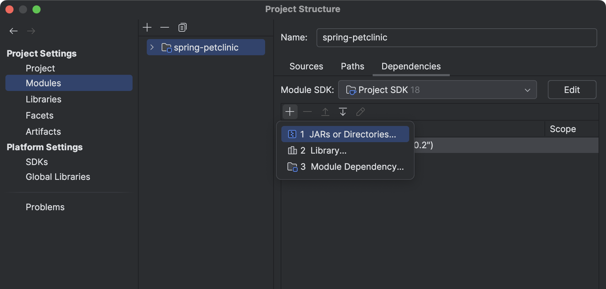
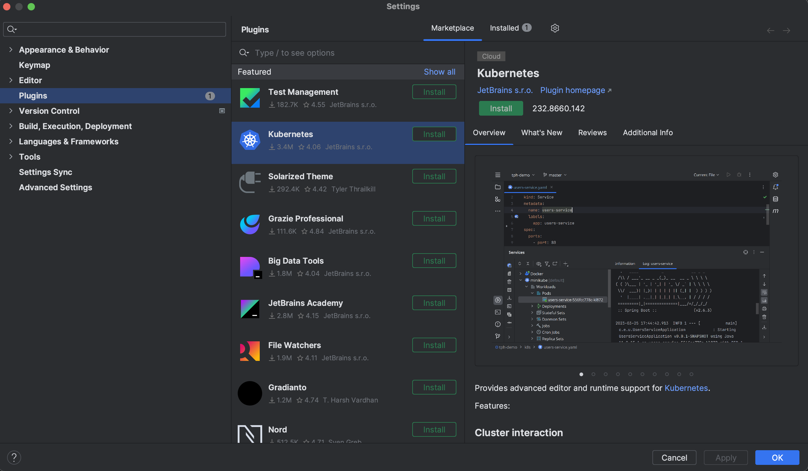
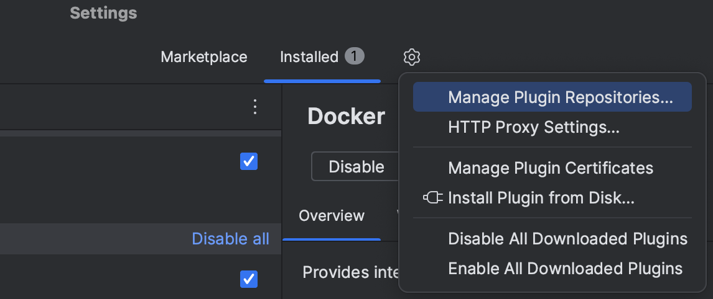
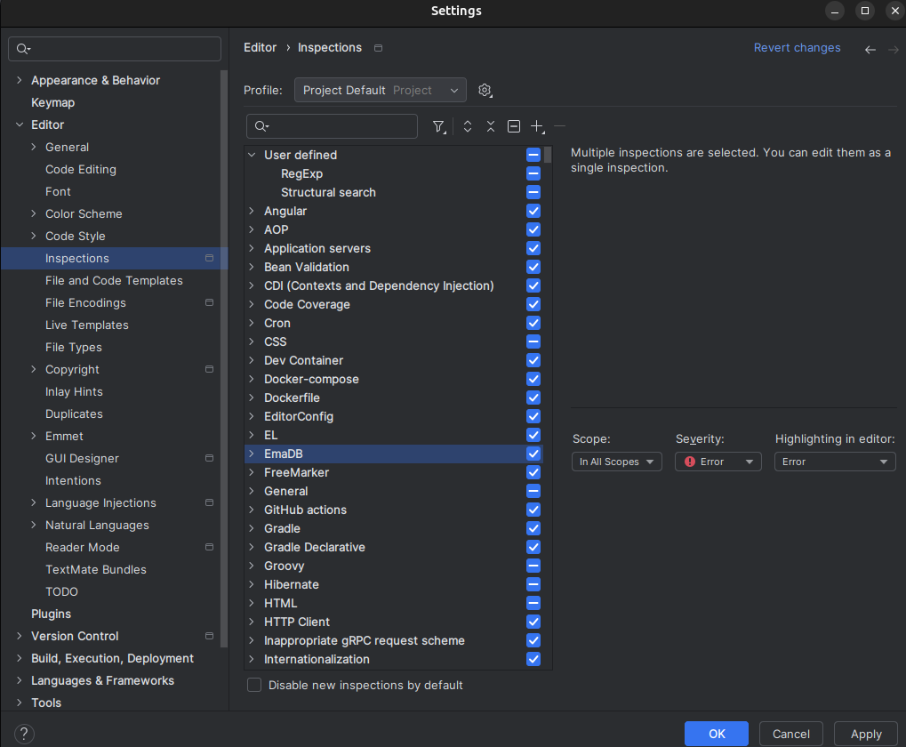

# EmaDB ORM

EmaDB is a lightweight Java ORM (Object-Relational Mapping) tool designed to simplify database interactions. It supports **PostgreSQL** and **MongoDB** (MongoDB support is currently in progress), offering a minimalistic setup for fast implementation and integration. This project is educational, intended as a foundation for learning and further development.

## Contributions are welcome!

## Features
- **Multi-Database Support**: Currently supports PostgreSQL with ongoing support for MongoDB.
- **Simple Configuration**: Define database connection details easily through annotations.
- **Dynamic Table Naming**: Automatic or custom table name generation.
- **Upsert Operations**: Insert or update records seamlessly using entity annotations.
- **Educational MVP**: Ideal for understanding and experimenting with ORM concepts.

---

## Installation

### **Using EmaDB as a Library**
1. **Download EmaDB Jar File**
  
   Download the latest version of [ema-db-1.0.jar](./releases/ema-db-1.0.jar).
2. **Add JAR to Project Build Path**
 
   

   Steps for adding external JARs in IntelliJ IDEA:

   1. Click **File** from the toolbar.
   2. Select the **Project Structure** option (`CTRL + SHIFT + ALT + S` on Windows/Linux, `⌘ + ;` on macOS).
   3. Select **Modules** from the left panel.
   4. Select the **Dependencies** tab.
   5. Click the **+** icon.
   6. Select **JARs or directories** option.
   
---

## Quick Start with EmaDB

### 1. Define Your Database Configuration  

   ```java
   @Config(db = DB.POSTGRESQL) // specify your DB type (default is POSTGRESQL)
   public class PostgresConfig implements IConfig {

       @Override
       public String getHost() { return "localhost"; }

       @Override
       public String getPort() { return "5432"; }

       @Override
       public String getDBName() { return "test"; }

       @Override
       public String getUsername() { return "emamagic"; }

       @Override
       public String getPassword() { return "1234"; }
   }
```

### 2. Define Entities and Use Key Annotations

EmaDB supports annotations to simplify your model definitions:

- **`@Entity`** - Marks the class as an entity mapped to a database table.
- **`@Id`** - Specifies the primary key field (supports `Integer` or `String` for UUID).
- **`@Transient`** - Ignores the field during database mapping.
- **`@Unique`** - Enforces a unique constraint.
- **`@Column`** - Sets a custom column name or nullability.

Each entity must also include a no-argument constructor for compatibility with EmaDB.

#### Example

```java
@Entity(db = DB.POSTGRESQL, name = "users")
public class User {
    @Id
    private Integer id; // Set as `String` to use UUIDs
    private String name;

    @Column(name = "nick_name", nullable = false)
    private String nickName; // Maps to `nick_name` in the DB as not null 

    @Unique
    private String email; // Unique field 

    @Transient
    private String sessionToken; // For internal use, not stored in DB
}
```

### 3. Perform CRUD Operations

Use EmaDB’s simple API for CRUD operations.

```java
public class Main {
    public static void main(String[] args) {

        // Insert or update a user record
        User upsertedUser = EmaDB.upsert(getUser());

        // Delete records
        boolean isDeleted = EmaDB.delete(getUser());

        // Read records
        List<User> users = EmaDB.read(User.class);

        // Close the database connection
        EmaDB.close();

    }

    private static User getUser() {
        var user = new User();
        user.setName("ali");
        user.setEmail("ali@gmail.com");
        return user;
    }
}
```
With these steps, developers can easily integrate and utilize EmaDB in their projects, with the optional plugin enhancing code quality through static analysis.


## Plugin Setup for Static Analysis (Optional)

The [EmaDB Plugin](https://github.com/emamagic/EmaDB_Plugin) (`ema-db-plugin-1.0.zip`) provides static code analysis for EmaDB annotations, ensuring a smooth development process and error detection directly in the IDE.

Download the latest version of [ema-db-plugin-1.0.zip](./releases/ema-db-plugin-1.0.zip).

1. **Install the [Plugin](https://github.com/emamagic/EmaDB_Plugin)**  
   In IntelliJ IDEA:
   - Go to **Settings** > **Plugins** > **Install Plugin from Disk...**
   
     

     
     

   - Select `ema-db-plugin-1.0.zip` and follow the installation instructions.
1. **Enable Static Analysis**  
   Once installed, you have to checked the EmaDB inspections and press OK.
   
   


### Ready to EmaDB like a Pro?

That’s it! 🎉 You’re now equipped to conquer database mapping with the elegance of EmaDB. Dive in, get creative, and may your ORM journey be smooth and bug-free. If you hit any bumps, just remember: it’s not a bug, it’s a “feature” in progress. 😉

Happy coding, and welcome to the EmaDB family!

---

## License

EmaDBPlugin is licensed under the MIT License:

<details>
<summary>MIT License</summary>

Permission is hereby granted, free of charge, to any person obtaining a copy  
of this software and associated documentation files (the "Software"), to deal  
in the Software without restriction, including without limitation the rights  
to use, copy, modify, merge, publish, distribute, sublicense, and/or sell  
copies of the Software, and to permit persons to whom the Software is  
furnished to do so, subject to the following conditions:

The above copyright notice and this permission notice shall be included in all  
copies or substantial portions of the Software.

THE SOFTWARE IS PROVIDED "AS IS", WITHOUT WARRANTY OF ANY KIND, EXPRESS OR  
IMPLIED, INCLUDING BUT NOT LIMITED TO THE WARRANTIES OF MERCHANTABILITY,  
FITNESS FOR A PARTICULAR PURPOSE AND NONINFRINGEMENT. IN NO EVENT SHALL THE  
AUTHORS OR COPYRIGHT HOLDERS BE LIABLE FOR ANY CLAIM, DAMAGES OR OTHER  
LIABILITY, WHETHER IN AN ACTION OF CONTRACT, TORT OR OTHERWISE, ARISING FROM,  
OUT OF OR IN CONNECTION WITH THE SOFTWARE OR THE USE OR OTHER DEALINGS IN THE  
SOFTWARE.

</details>

